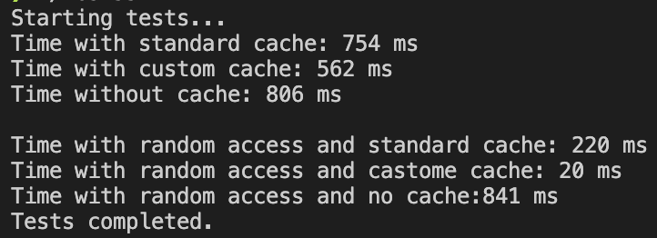

P3309 Зайцева Ирина Сергеевна
Базовый трек, оценка 3. ЛР 2.
Вариант:  LFU, macOS
Преподаватель: Гиниятуллин Арслан Рафаилович


### Основные структуры
`CacheBlock`: Структура, представляющая один блок кэша, включает:
```c++
typedef struct
{
    off_t offset;           //Смещение в файле
    char *data;             //Буфер данных блока
    size_t size;            // Размер блока
    int valid;              //Флаг, показывающий, что блок содержит валидные данные
    int access_count;       //Счетчик обращений к блоку, используемый для алгоритма вытеснения LFU
    int dirty;              //Флаг, указывающий, что блок был изменен, но изменения не записаны на диск.
} CacheBlock;
```
`BlockCache`: Структура для управления кэшем:
```c++
typedef struct
{
    CacheBlock *blocks;     //Массив блоков кэша
    size_t block_count;     //Количество блоков в кэше
    size_t block_size;      //Размер одного блока
    pthread_mutex_t lock;   // Мьютекс для синхронизации доступа к кэшу
    int fd;                 //Дескриптор открытого файла
} BlockCache;
```
### Основные функции
- `find_least_used_block`:
Ищет и возвращает блок с наименьшим количеством обращений. Этот блок будет вытеснен, если нужно освободить место в кэше.
- `evict_cache_block`:
Освобождает блок, который был использован наименее часто. Если блок был изменен, его данные записываются обратно на диск перед удалением.
- `find_or_allocate_block`:
Ищет блок в кэше по смещению. Если блок не найден, выделяет новый и заполняет его данными с диска. Также обновляет счетчик обращений и другие параметры блока.
- `lab2_open`:
Открывает файл с флагом O_SYNC, который обеспечивает синхронизацию данных при записи. Инициализирует кэш, выделяет память для блоков и инициализирует мьютекс для синхронизации.
- `lab2_close`:
Закрывает файл, записывает измененные данные всех валидных блоков на диск, освобождает память, занятую блоками кэша, и уничтожает мьютекс.
- `lab2_read`:
Выполняет чтение данных из файла с использованием кэша. Если данные уже находятся в кэше, они копируются из него. Если нет — блок с необходимыми данными загружается с диска.
- `lab2_write`:
Записывает данные в файл с использованием кэша. Измененные блоки помечаются как грязные, чтобы их данные можно было записать на диск позже.
- `lab2_lseek`:
Выполняет перемещение файлового указателя в заданное положение.
- `lab2_fsync`:
Синхронизирует все изменения данных в кэше с файлом, записывая все грязные блоки на диск, а затем вызывает fsync для завершения синхронизации на уровне операционной системы.


### 

В первой группе сценариев, когда доступ к данным осуществляется последовательно, кастомный кеш не приносит значительного выигрыша. Это связано с тем, что данные используются в предсказуемом порядке.

Во второй группе, при случайном доступе, ситуация меняется. Здесь выигрывает политика, реализованная лабораторной работе, поскольку она позволяет более эффективно управлять памятью, вытесняя менее часто используемые блоки и сохраняя те, которые обращаются чаще.
 

